# NanoClaw Architecture

A single Node.js process that routes messages from WhatsApp to Claude agents running in isolated Docker containers. Each chat group gets its own container, filesystem, and memory.

---

## System Overview

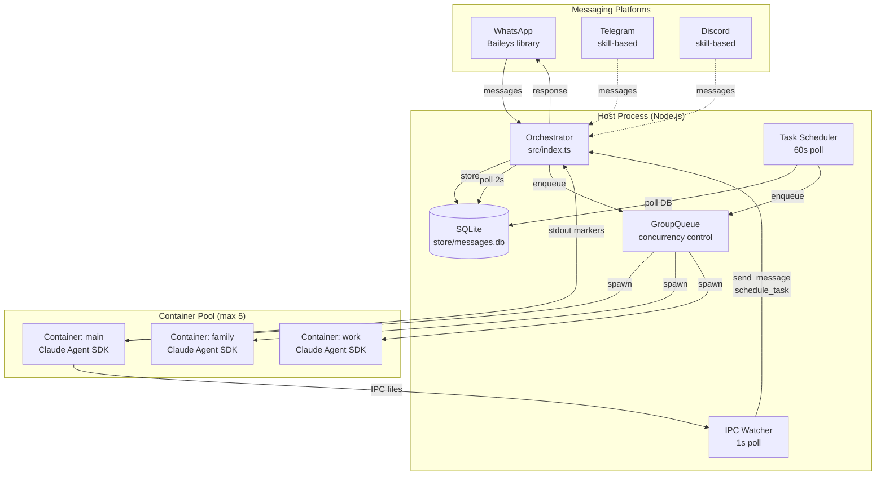

**Key design decisions:**
- **Polling over events** — The message loop polls SQLite every 2 seconds rather than using push-based events. This simplifies crash recovery: if the process dies, it resumes from the last stored cursor.
- **File-based IPC** — Containers communicate with the host via JSON files in per-group directories, not sockets or pipes. This is simple, debuggable, and naturally namespaced.
- **Container-per-invocation** — Each agent run gets a fresh container. State persists through mounted volumes (group folder, Claude sessions), not through long-lived processes.

---

## Message Lifecycle

This is the complete path a message takes from arrival to response.

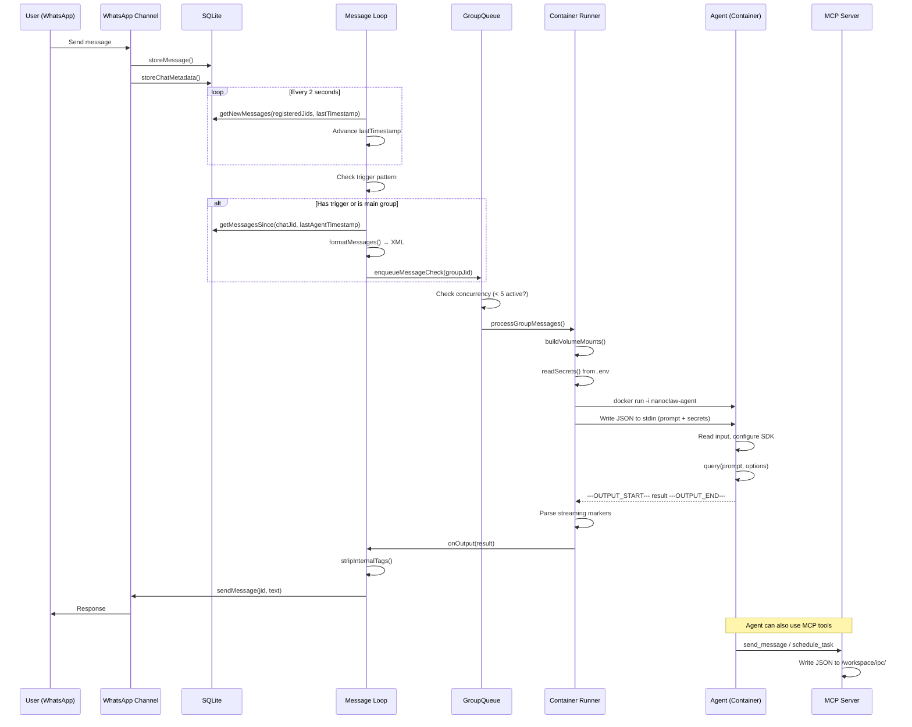

### Cursor Management and Crash Recovery

The orchestrator maintains two cursors per group:

| Cursor | Purpose | Updated When |
|--------|---------|-------------|
| `lastTimestamp` | Global — marks newest message the loop has seen | Immediately when messages are read (before processing) |
| `lastAgentTimestamp[jid]` | Per-group — marks newest message the agent has processed | After agent returns successfully |

Advancing `lastTimestamp` before processing means a crash won't skip messages. The `recoverPendingMessages()` function on startup checks for messages between `lastAgentTimestamp` and `lastTimestamp` to catch anything that was read but not yet processed.

---

## Container Isolation

Each group's container is an isolated Linux environment with carefully controlled access.

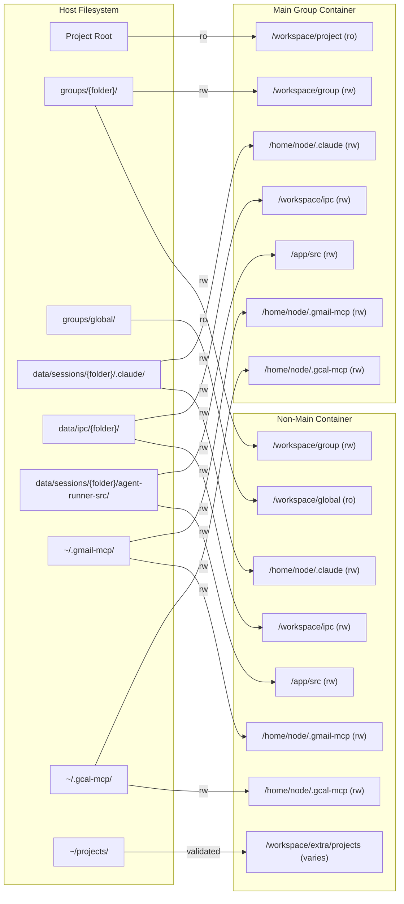

### Mount Differences by Group Type

| Mount | Main Group | Non-Main Group |
|-------|-----------|----------------|
| `/workspace/project` | Project root (read-only) | Not mounted |
| `/workspace/group` | `groups/main/` (rw) | `groups/{folder}/` (rw) |
| `/workspace/global` | Not mounted | `groups/global/` (ro) |
| `/home/node/.claude` | Isolated sessions (rw) | Isolated sessions (rw) |
| `/workspace/ipc` | Isolated IPC (rw) | Isolated IPC (rw) |
| `/app/src` | Agent runner source (rw) | Agent runner source (rw) |
| `/home/node/.gmail-mcp` | `~/.gmail-mcp` (rw, conditional) | `~/.gmail-mcp` (rw, conditional) |
| `/home/node/.gcal-mcp` | `~/.gcal-mcp` (rw, conditional) | `~/.gcal-mcp` (rw, conditional) |
| `/workspace/extra/*` | Via allowlist | Via allowlist (forced ro if `nonMainReadOnly`) |

### Security Layers

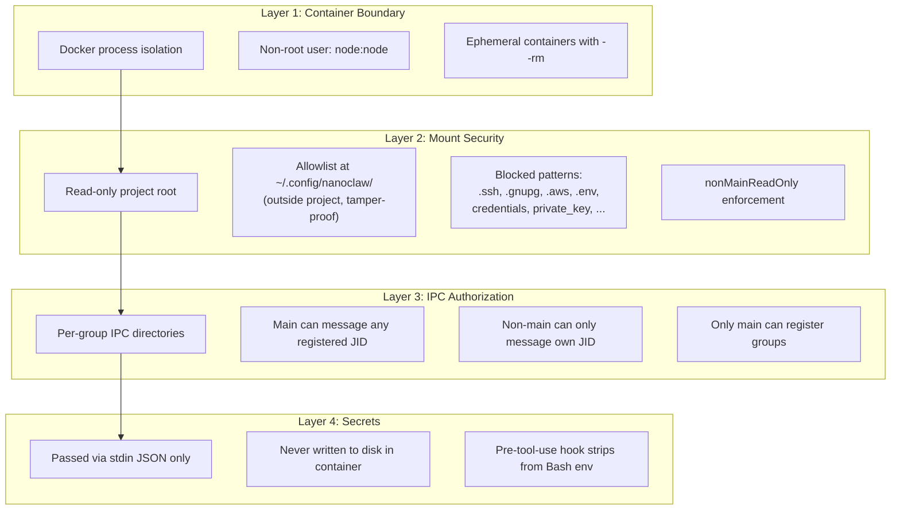

### Credential Flow

Secrets (`CLAUDE_CODE_OAUTH_TOKEN`, `ANTHROPIC_API_KEY`) follow a strict path:

1. **Host**: Read from `.env` by `readEnvFile()` — never loaded into `process.env`
2. **Container spawn**: Passed as part of stdin JSON (`secrets` field)
3. **Container entrypoint**: Written to `/tmp/input.json`, read by agent-runner, file consumed
4. **Agent SDK**: Set in the SDK `env` option, not in `process.env`
5. **Bash tool**: Pre-tool-use hook injects `unset` commands to strip credentials before any shell execution

**Google API OAuth credentials** (Gmail, Calendar) follow a separate path — each service stores credentials in its own host directory (`~/.gmail-mcp/`, `~/.gcal-mcp/`) which is bind-mounted (read-write) into every container. The MCP servers read these directly and may refresh tokens in-place. Mounts are conditional: only added if the directory exists on the host. Both services share the same GCP OAuth client ID but maintain separate tokens with different scopes.

---

## Container Internals

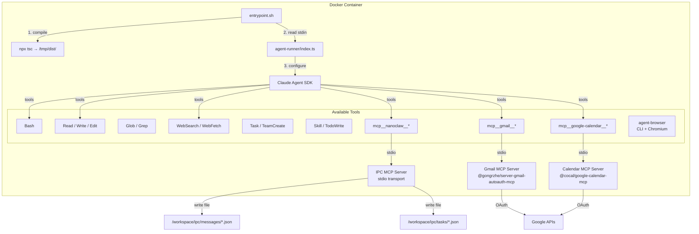

### Agent Runner Query Loop

The agent runner doesn't exit after a single query. It stays alive to handle follow-up messages via IPC.

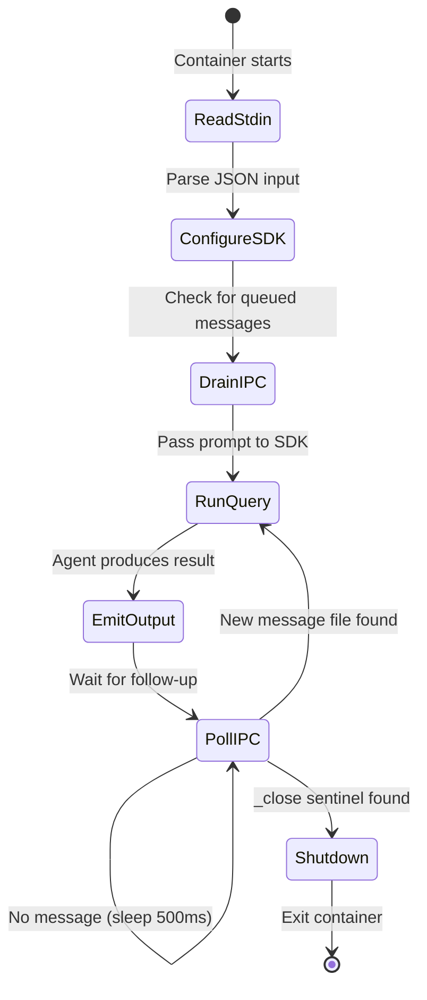

**IPC input polling** (`/workspace/ipc/input/`):
- JSON files: `{type: "message", text: "..."}` — new user messages piped in by host
- Sentinel: `_close` file — signals the container to wind down gracefully
- Poll interval: 500ms

### MCP Tools Available to Agents

The `ipc-mcp-stdio.ts` server exposes these tools to the Claude Agent SDK:

| Tool | Description | Authorization |
|------|-------------|--------------|
| `send_message` | Send a message to the chat immediately | Main → any registered JID; others → own JID only |
| `schedule_task` | Create a recurring or one-time task | Main → any group; others → own group only |
| `list_tasks` | List scheduled tasks | Main sees all; others see own group only |
| `pause_task` | Pause a scheduled task | Own group or main |
| `resume_task` | Resume a paused task | Own group or main |
| `cancel_task` | Cancel and delete a task | Own group or main |
| `register_group` | Register a new WhatsApp group for the bot | Main only |

---

## Concurrency: GroupQueue

The GroupQueue serializes container execution per group (one container at a time per group) while parallelizing across groups up to a global limit.

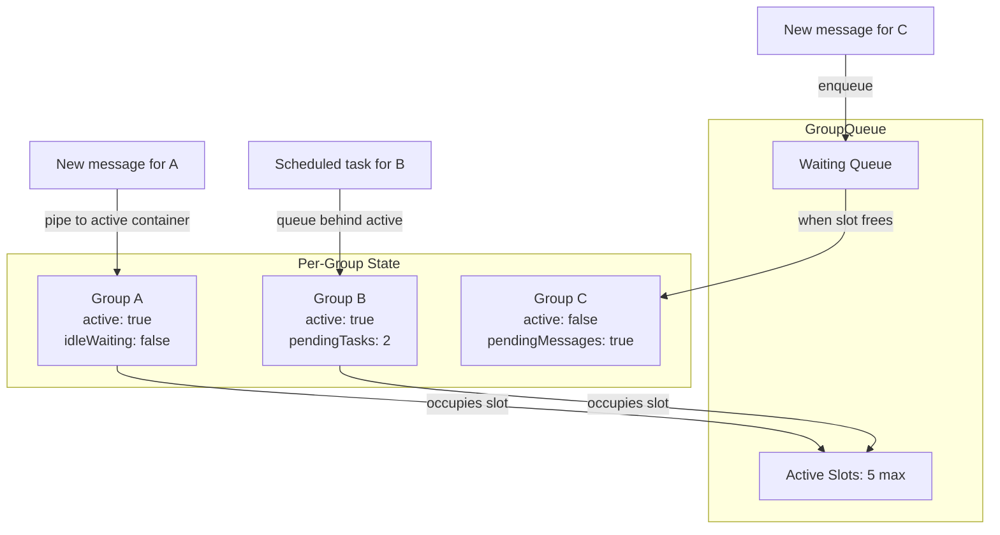

### Enqueueing Logic

```
enqueueMessageCheck(groupJid):
  if group has active container:
    mark pendingMessages = true        # will be drained after current work
  else if activeCount >= MAX_CONCURRENT:
    add to waitingGroups queue
  else:
    start container immediately

enqueueTask(groupJid, taskId, fn):
  if group has active container:
    append to pendingTasks
    if container is idle-waiting:
      close stdin → preempt idle to start task
  else if activeCount >= MAX_CONCURRENT:
    add to waitingGroups queue
  else:
    start task immediately
```

### Drain Priority

When a container finishes, the queue drains in this order:
1. **Pending tasks for same group** (tasks won't be re-discovered by scheduler)
2. **Pending messages for same group** (new messages arrived during execution)
3. **Waiting groups** (tasks first, then messages)

### Retry Strategy

On container failure:
- Base delay: 5 seconds
- Backoff: exponential — `5s × 2^(retryCount-1)` → 5s, 10s, 20s, 40s, 80s
- Max retries: 5
- After max: drop (next incoming message triggers fresh attempt)

---

## Idle Timeout and Container Lifecycle

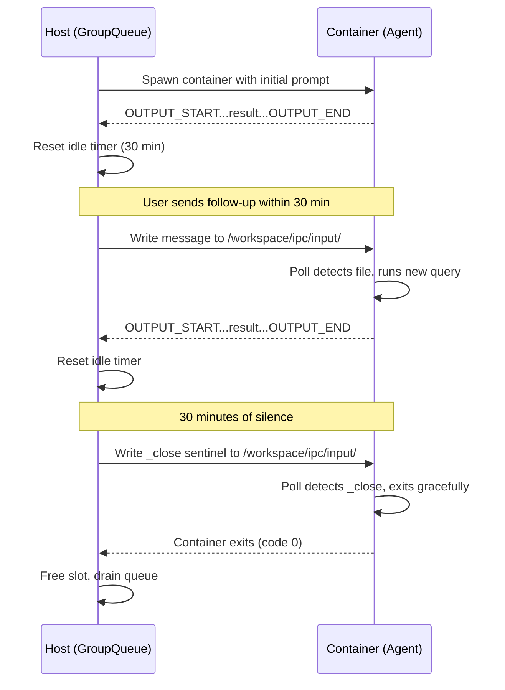

**Timeout values:**
- **Idle timeout**: 30 minutes (configurable via `IDLE_TIMEOUT`)
- **Hard timeout**: `max(group.timeout || CONTAINER_TIMEOUT, IDLE_TIMEOUT + 30s)`
- **Timer resets**: On each streaming output from container
- **Timer does NOT reset**: On stderr (SDK debug logs)

---

## Scheduled Tasks

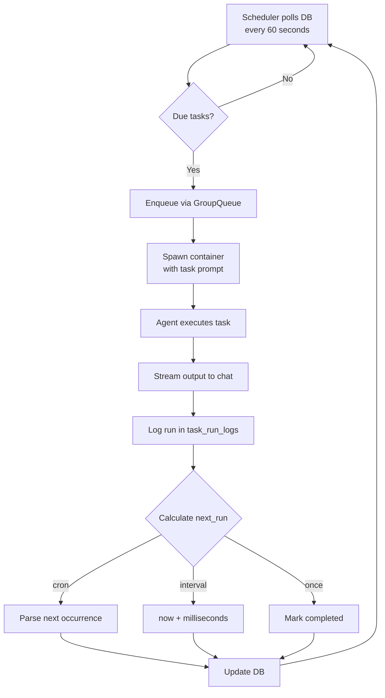

### Schedule Types

| Type | Value Format | Example | Repeats |
|------|-------------|---------|---------|
| `cron` | Cron expression | `0 9 * * 1-5` | Yes, until paused/cancelled |
| `interval` | Milliseconds | `3600000` | Yes, every N ms |
| `once` | ISO timestamp | `2026-03-01T14:30:00Z` | No, auto-completes |

### Context Modes

| Mode | Session | Use Case |
|------|---------|----------|
| `isolated` | New session each run | Stateless tasks (weather reports, reminders) |
| `group` | Reuses group's session | Stateful tasks (project tracking, research) |

---

## Database Schema

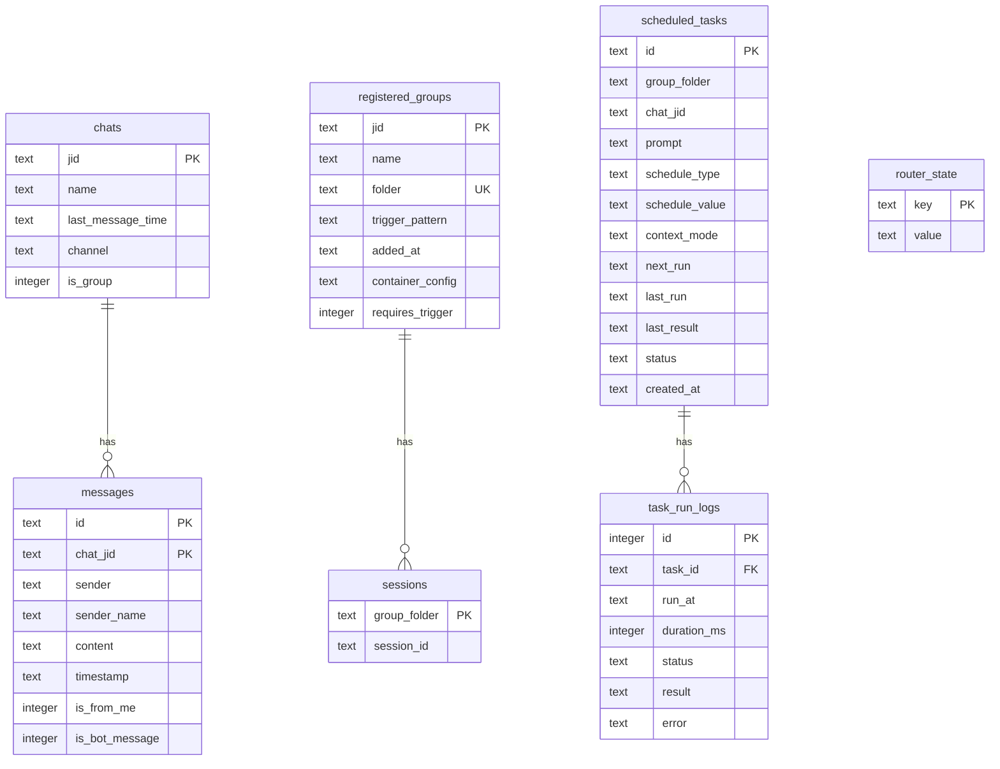

### Key Queries

| Operation | Function | Description |
|-----------|----------|-------------|
| New messages | `getNewMessages(jids, lastTimestamp)` | Messages newer than cursor for registered groups |
| Context gathering | `getMessagesSince(chatJid, since)` | All messages since last agent run (for prompt context) |
| Due tasks | `getDueTasks()` | Tasks with `status='active'` and `next_run <= now` |
| Store message | `storeMessage(msg)` | Insert or replace (deduplication by id + chat_jid) |

---

## Channel Abstraction

All messaging platforms implement the same interface:

```typescript
interface Channel {
  name: string;
  connect(): Promise<void>;
  sendMessage(jid: string, text: string): Promise<void>;
  isConnected(): boolean;
  ownsJid(jid: string): boolean;
  disconnect(): Promise<void>;
  setTyping?(jid: string, isTyping: boolean): Promise<void>;
}
```

**JID (Jabber ID) formats:**

| Platform | Individual | Group |
|----------|-----------|-------|
| WhatsApp | `14155551234@s.whatsapp.net` | `120363336345536173@g.us` |
| Telegram | `tg:chat-id` | `tg:group-id` |
| Discord | `dc:user-id` | `dc:channel-id` |

Additional channels (Telegram, Discord, Gmail) are added via Claude Code skills (`/add-telegram`, etc.) — they aren't part of the base codebase.

---

## File-Based IPC

Containers communicate with the host through JSON files in namespaced directories.

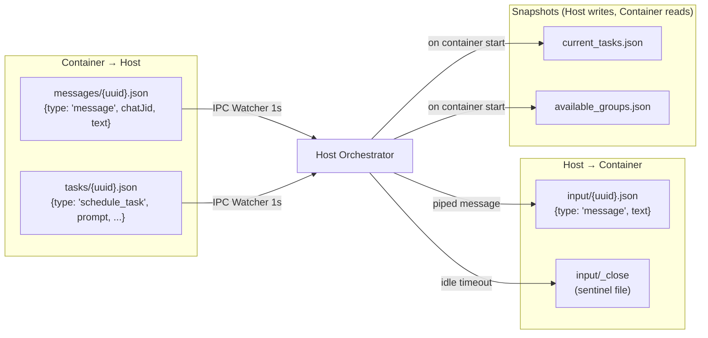

All paths are under `data/ipc/{groupFolder}/`. The per-group namespacing prevents cross-group privilege escalation.

---

## Memory Hierarchy

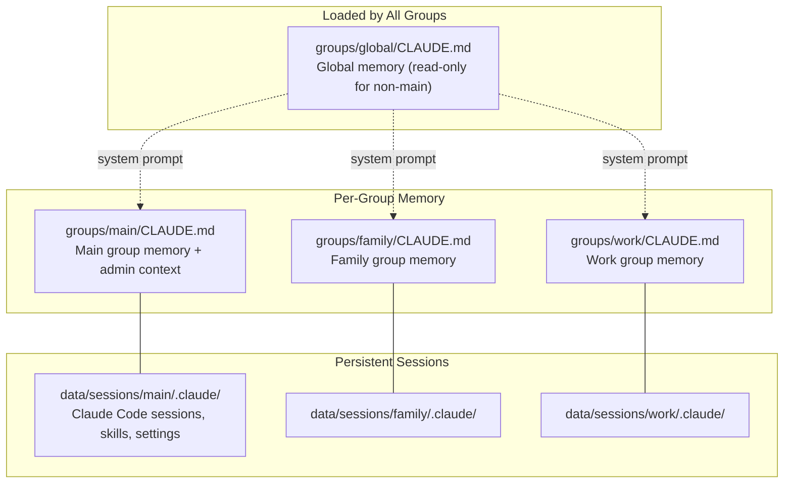

- **Global CLAUDE.md**: Loaded as the system prompt for all agent invocations. Contains identity, personality, formatting rules, and capabilities shared across all groups.
- **Group CLAUDE.md**: Each group's working directory contains its own CLAUDE.md with group-specific context, preferences, and notes.
- **Claude sessions**: The `.claude/` directory persists Claude Code's auto-memory, skills, and session transcripts between container runs.
- **Conversations archive**: The agent-runner's `PreCompactHook` archives full conversation transcripts to `groups/{folder}/conversations/` as markdown files.

---

## Project Layout

```
nanoclaw/
├── src/                          # Host process source
│   ├── index.ts                  # Orchestrator: state, message loop, agent invocation
│   ├── channels/
│   │   └── whatsapp.ts           # WhatsApp via Baileys (LID translation, group sync)
│   ├── config.ts                 # Constants: paths, timeouts, trigger pattern
│   ├── types.ts                  # TypeScript interfaces (Channel, RegisteredGroup, etc.)
│   ├── db.ts                     # SQLite queries (messages, chats, tasks, sessions)
│   ├── router.ts                 # XML message formatting, outbound routing
│   ├── container-runner.ts       # Container spawn, volume mounts, output parsing
│   ├── container-runtime.ts      # Docker/Apple Container abstraction
│   ├── group-queue.ts            # Per-group serialization, global concurrency
│   ├── group-folder.ts           # Folder validation (prevents path traversal)
│   ├── mount-security.ts         # Allowlist validation for additional mounts
│   ├── task-scheduler.ts         # Cron/interval/once task execution
│   ├── ipc.ts                    # File-based IPC watcher (1s poll)
│   ├── env.ts                    # .env reader (never loads into process.env)
│   └── logger.ts                 # Pino logger
│
├── container/                    # Agent container image
│   ├── Dockerfile                # node:22-slim + Chromium + claude-code + agent-browser
│   ├── build.sh                  # Build script
│   ├── agent-runner/             # Code that runs INSIDE the container
│   │   ├── src/
│   │   │   ├── index.ts          # Agent entry: stdin → SDK query → stdout markers
│   │   │   └── ipc-mcp-stdio.ts  # MCP server (send_message, schedule_task, etc.)
│   │   └── package.json          # @anthropic-ai/claude-agent-sdk, zod, etc.
│   └── skills/
│       └── agent-browser/        # Browser automation skill (Playwright CLI)
│
├── groups/                       # Per-group working directories
│   ├── global/CLAUDE.md          # Shared memory across all groups
│   └── main/CLAUDE.md            # Main channel memory + admin context
│
├── data/                         # Runtime state (not in git)
│   ├── sessions/{folder}/.claude/ # Per-group Claude Code sessions
│   └── ipc/{folder}/             # Per-group IPC directories
│
├── store/                        # Persistent storage (not in git)
│   ├── auth/                     # WhatsApp credentials (Baileys)
│   └── messages.db               # SQLite database
│
├── setup/                        # Setup steps (used by /setup skill)
├── docs/                         # Documentation
└── .claude/skills/               # Claude Code skills (/setup, /customize, /debug, etc.)
```

---

## Key Configuration

| Variable | Default | Description |
|----------|---------|-------------|
| `ASSISTANT_NAME` | `Andy` | Trigger word and response prefix |
| `ASSISTANT_HAS_OWN_NUMBER` | `false` | If true, bot has its own phone number |
| `POLL_INTERVAL` | `2000` ms | Message loop poll frequency |
| `IDLE_TIMEOUT` | `1800000` ms (30 min) | Keep container alive after last output |
| `CONTAINER_TIMEOUT` | `1800000` ms (30 min) | Hard container timeout |
| `MAX_CONCURRENT_CONTAINERS` | `5` | Global concurrency limit |
| `IPC_POLL_INTERVAL` | `1000` ms | IPC watcher frequency (host side) |
| `SCHEDULER_POLL_INTERVAL` | `60000` ms | Scheduled task check frequency |
| `CONTAINER_MAX_OUTPUT_SIZE` | `10485760` (10 MB) | Max accumulated stdout/stderr |
| `TRIGGER_PATTERN` | `^@{name}\b` (case-insensitive) | Regex for activating the bot |

---

## Startup Sequence

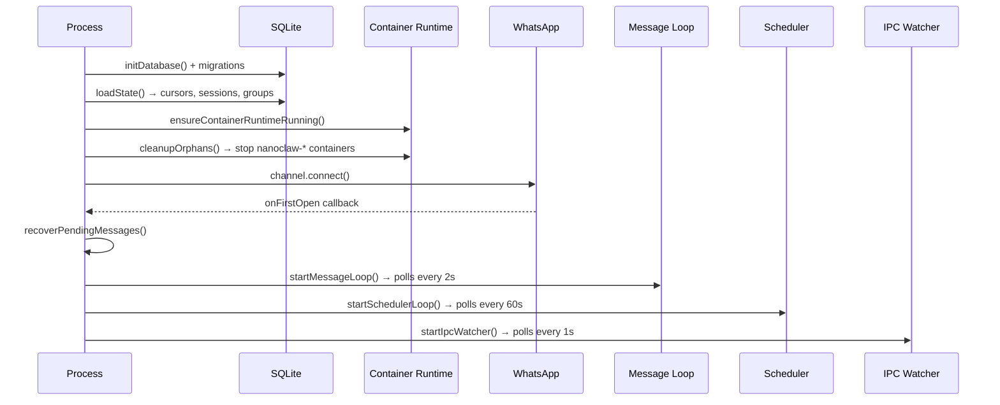

### Shutdown

The process handles `SIGTERM`/`SIGINT` gracefully:
1. Disconnects all channels (WhatsApp)
2. Calls `queue.shutdown(10000)` — **detaches** containers (doesn't kill them)
3. Containers finish on their own via their timeout mechanisms
4. Prevents a host restart from killing working agents mid-response
